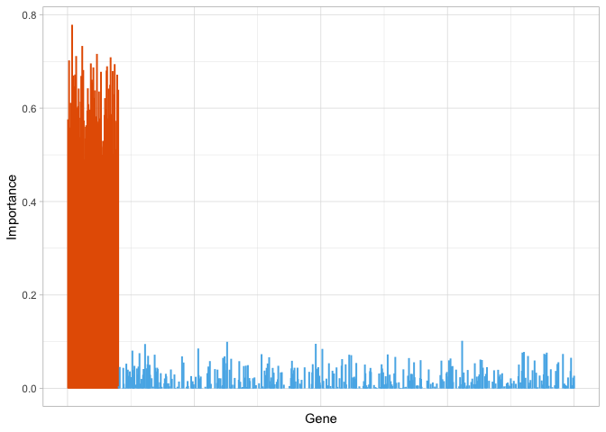

RZiMM-scRNA [](https://doi.org/10.5281/zenodo.4595924)
================

**RZiMM-scRNA**, a regularized zero-inflated mixture model designed for
sparse single-cell RNA-seq data with sample heterogeneity (Paper to be
submitted).

RZiMM-scRNA take within-sample correlation into consideration,
simultaneously cluster the cells into groups and identify differentially
expressed genes among groups.

# Installation

In R,

``` r
devtools::install_github("SkadiEye/RZiMM")
```

# Example

``` r
suppressMessages(library(RZiMM))
## Load example data
data("sim_x")
x <- sim_x$x
sample_index <- sim_x$sample_index

set.seed(4321)
## Run RZiMM model (adjusting for sample correlation)
rzimm_mod <- RZiMM(x, sample_index, n_group = 4, lambda1 = 30)

## Clustering result
table(rzimm_cluster(rzimm_mod), sim_x$cluster)
```

    ##    
    ##       1   2   3   4
    ##   1   0   0   0 271
    ##   2   0   0 244   0
    ##   3 242   0   0   0
    ##   4   0 243   0   0

``` r
## Plot Impotance
importance_plot(rzimm_mod)
```

<!-- -->

# References
